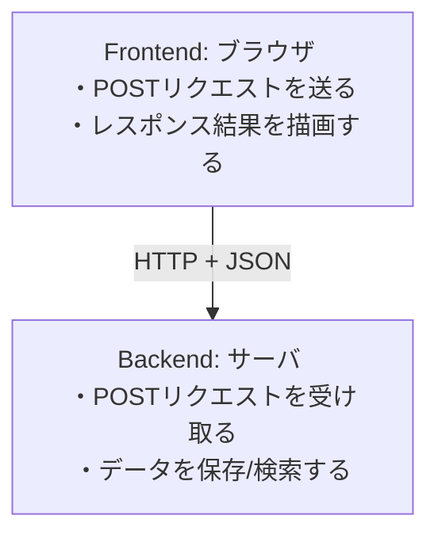

# 観察結果からFrontend/Backend構成図を作る

```mermaid
flowchart TD
    A["Frontend: ブラウザ <br/>・POSTリクエストを送る<br/>・レスポンス結果を描画する"]
    B["Backend: サーバ <br/>・POSTリクエストを受け取る<br/>・データを保存/検索する"]
    A -- "HTTP + JSON" --> B
```
